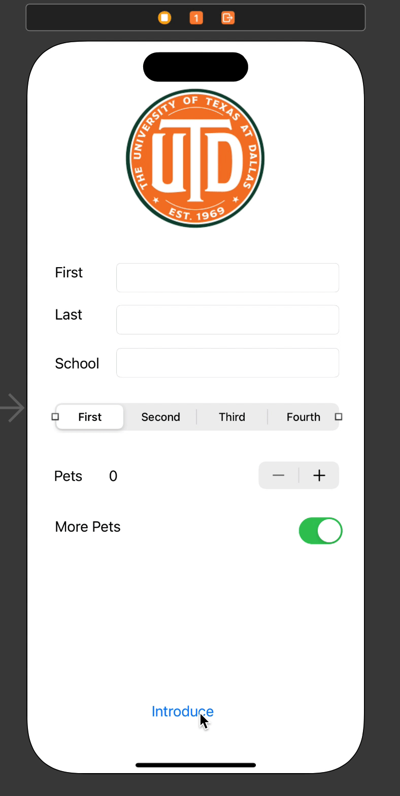

# IOS Prework - *IOS*

Submitted by: **Cory Harris**

**IOS** is an IOS app that shows an personal information, and allows pressing a button to display intro. 

Time spent: **2** hours spent in total

## Required Features

The following **required** functionality is completed:

* [x] User can input name, last name, school name into textfield
* [x] Screen shows picture of school logo/name
* [x] User can select the academic year from segmented control
* [ ] Increase the number of pets label using stepper
* [ ] App presents an alert when the "Introduce Self" button is tapped

The following **optional** feature ideas are not yet implemented:

* [ ] improve UI/UX
* [ ] Adding the ability of the user to change the response when the button is clicked
* [ ] customizing the background so it is not a white screen
* [ ] adding multiple pages to the app to allow more pictures and buttons

## Video Walkthrough

Here's a walkthrough of implemented features:

GIF created with ...  

[Kap](https://getkap.co/) for macOS

## Notes

Time constraint and setting up XCode were my biggest challenges here
## License

    Copyright [2023] [Cory Harris - via CodePath]

    Licensed under the Apache License, Version 2.0 (the "License");
    you may not use this file except in compliance with the License.
    You may obtain a copy of the License at

        http://www.apache.org/licenses/LICENSE-2.0

    Unless required by applicable law or agreed to in writing, software
    distributed under the License is distributed on an "AS IS" BASIS,
    WITHOUT WARRANTIES OR CONDITIONS OF ANY KIND, either express or implied.
    See the License for the specific language governing permissions and
    limitations under the License.

